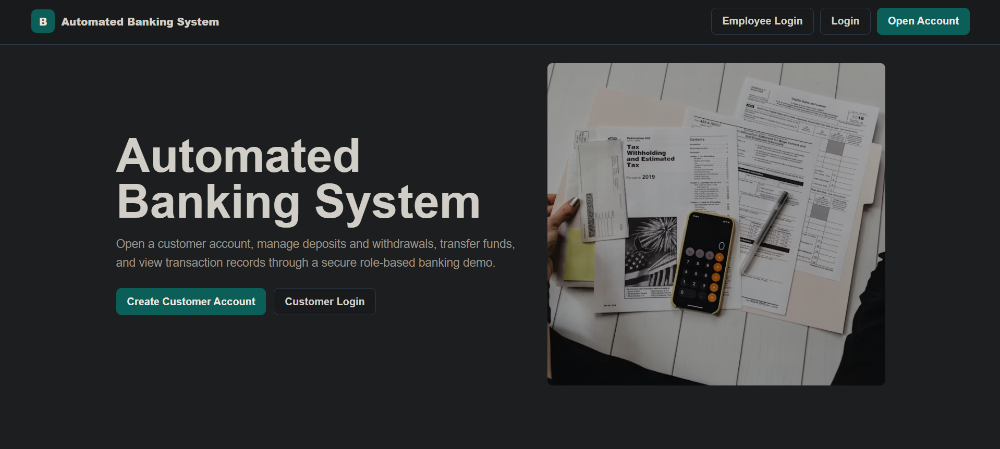
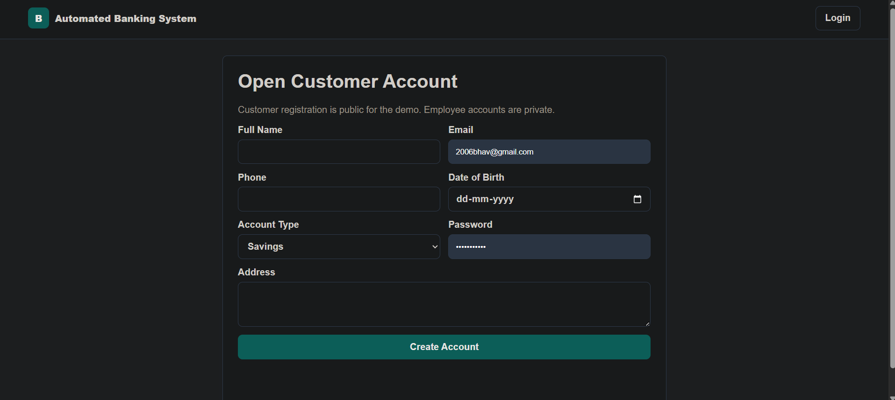
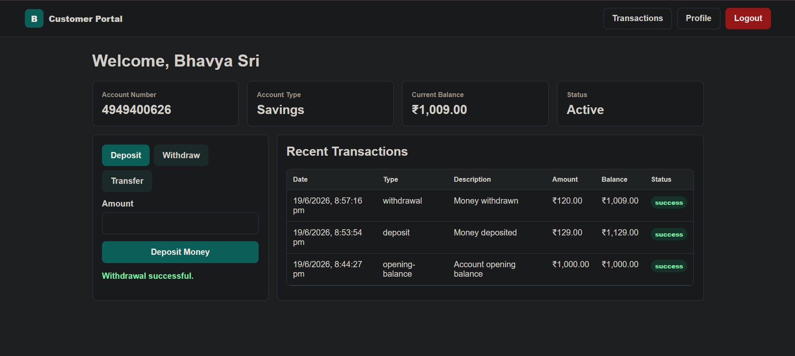
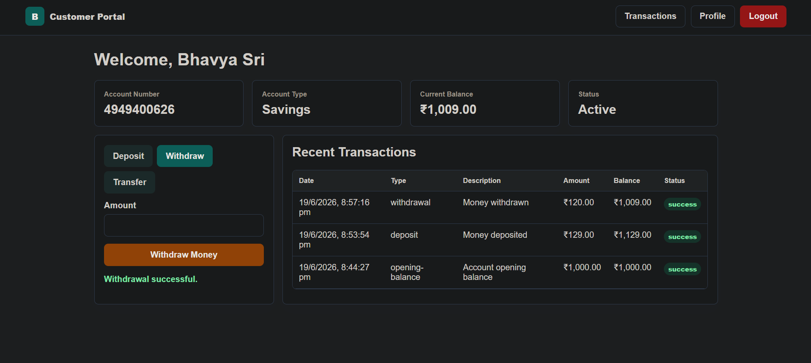
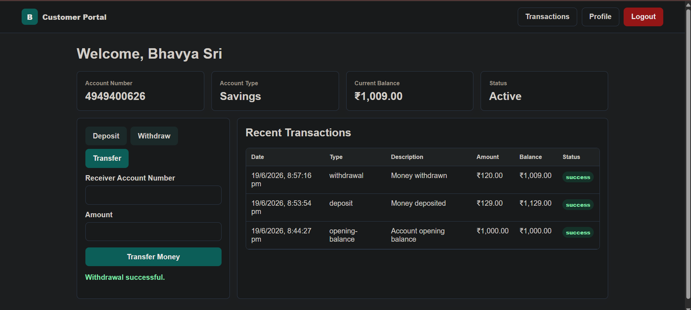
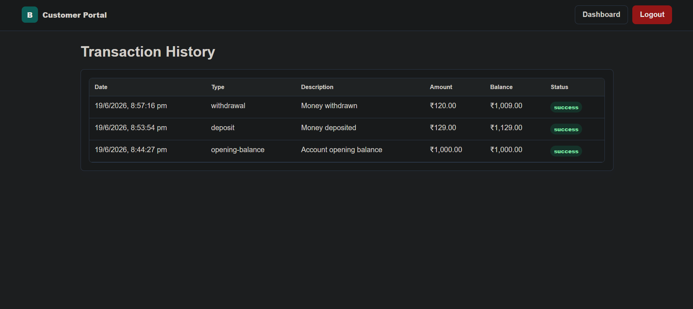
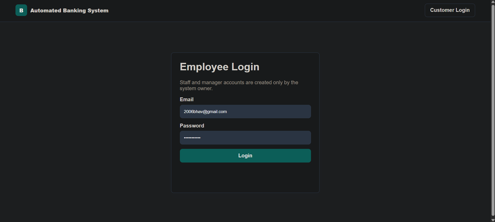
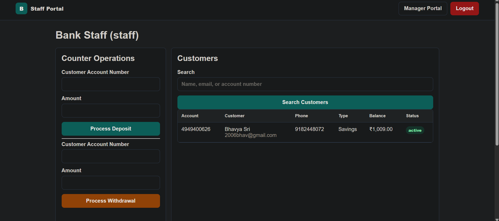
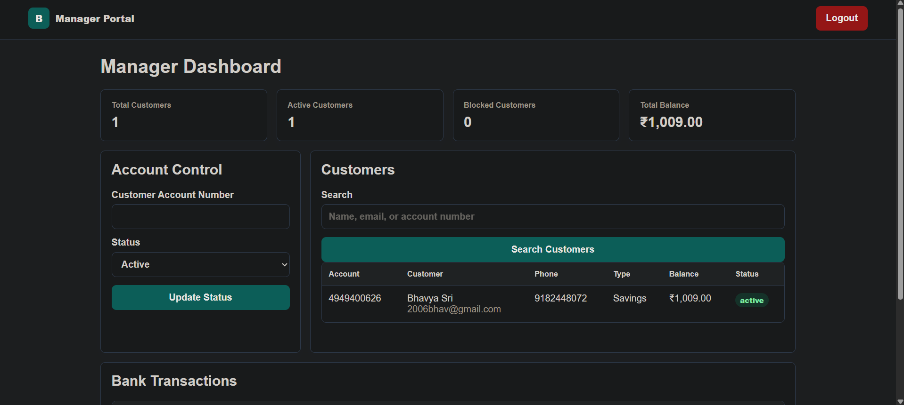

<h1 align="center">🏦 Automated Banking System</h1>

<p align="center">
A secure and efficient banking management platform for customers, employees, staff, and managers.
</p>

<p align="center">
<a href="https://automated-banking-system-c7df4.web.app/">🌐 Live Demo</a> •
<a href="#features">Features</a> •
<a href="#application-screenshots">Screenshots</a> •
<a href="#documentation">Documentation</a>
</p>

## 📌 Project Overview

The Automated Banking System is developed to digitalize traditional banking processes and provide an efficient platform for both customers and bank staff.

The application supports:

- Customer Registration & Authentication
- Secure Login System
- Deposit & Withdrawal Operations
- Fund Transfers
- Transaction History Tracking
- Employee Management Portal
- Staff Operations Portal
- Manager Dashboard
- Role-Based Access Control

The project follows Software Engineering principles and includes complete system documentation, UML diagrams, and deployment artifacts.

---

## 🎯 Objectives

- Automate banking activities
- Reduce manual processing errors
- Improve transaction efficiency
- Enhance security and user authentication
- Provide separate interfaces for customers and bank employees
- Maintain transaction records digitally

---

## 🚀 Features

### Customer Features

✅ Create New Account

✅ Secure Login

✅ Deposit Funds

✅ Withdraw Funds

✅ Transfer Money

✅ View Transaction History

✅ Manage Personal Banking Activities

---

### Employee Features

✅ Employee Login Portal

✅ Customer Account Assistance

✅ Transaction Monitoring

✅ Account Management

---

### Staff Features

✅ Staff Portal Access

✅ Customer Service Operations

✅ Banking Record Management

---

### Manager Features

✅ Manager Dashboard

✅ Employee Monitoring

✅ Banking Activity Overview

✅ Administrative Controls

---

## 🛠️ Technology Stack

### Frontend

- HTML5
- CSS3
- JavaScript

### Backend

- Java

### Database

- MySQL

### Tools Used

- Git & GitHub
- UML Modeling Tools
- Microsoft Word

---

## 📂 Project Structure

```text
automated-banking-system/
│
├── codes/
│   └── Source Code Files
│
├── documents/
│   ├── Srs.docx
│   ├── Requirements Gathering.docx
│   ├── USE CASE & CLASS DIAGRAM.docx
│   ├── Object Diagram.docx
│   ├── Banking Automated System Sequence Diagram.pdf
│   └── Banking Deployment Diagram.pdf
│
├── images/
│   ├── Login_page.png
│   ├── sign_up.png
│   ├── customer_portal_deposit.png
│   ├── customer_portal_withdraw.png
│   ├── customer_portal_transfer.png
│   ├── customer_portal_transaction_history.png
│   ├── employee_login.png
│   ├── staff_portal.png
│   └── manager_portal.png
│
└── README.md
```

---

# 📸 Application Screenshots

<div align="center">

<table>
<tr>
<td align="center">
<b>Login Page</b><br>

</td>

<td align="center">
<b>Registration Page</b><br>

</td>
</tr>

<tr>
<td align="center">
<b>Deposit Funds</b><br>

</td>

<td align="center">
<b>Withdraw Funds</b><br>

</td>
</tr>

<tr>
<td align="center">
<b>Transfer Funds</b><br>

</td>

<td align="center">
<b>Transaction History</b><br>

</td>
</tr>

<tr>
<td align="center">
<b>Employee Login</b><br>

</td>

<td align="center">
<b>Staff Portal</b><br>

</td>
</tr>

<tr>
<td align="center">
<b>Manager Dashboard</b><br>

</td>

<td align="center">
&nbsp;
</td>
</tr>

</table>

</div>


# 📚 Documentation

The project includes complete Software Engineering documentation.

| Document | Description |
|-----------|-------------|
| SRS | Software Requirements Specification |
| Requirements Gathering | Functional and Non-Functional Requirements |
| Use Case Diagram | User-System Interactions |
| Class Diagram | System Class Structure |
| Object Diagram | Object Relationships |
| Sequence Diagram | Workflow Execution |
| Deployment Diagram | System Deployment Architecture |

All documents can be found inside the **documents/** folder.

---

# 🔄 System Workflow

1. User registers an account.
2. User logs into the system.
3. Customer performs:
   - Deposit
   - Withdrawal
   - Fund Transfer
4. Transaction data is stored.
5. Employees manage customer operations.
6. Managers monitor overall banking activities.

---

# 🔐 Security Features

- User Authentication
- Role-Based Access Control
- Secure Transaction Processing
- Session Management
- Data Validation

---

# 📈 Future Enhancements

- Two-Factor Authentication (2FA)
- Mobile Banking Application
- Online Loan Processing
- Email Notifications
- SMS Alerts
- AI-Based Fraud Detection
- Account Statement Generation

---

# 👨‍💻 Author

**Bhavya Sri**

B.Tech Computer Science and Engineering  
VIT-AP University

GitHub: https://github.com/Bhavya-41206

---

## ⭐ Support

If you found this project useful, consider giving the repository a ⭐ on GitHub.
